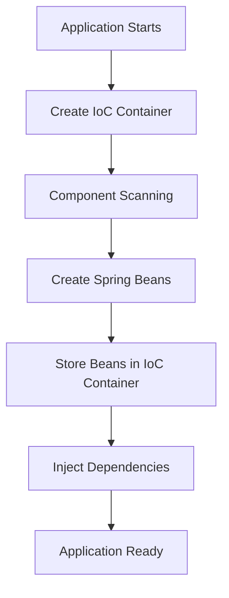

# IoC (Inversion of Control) Container

> **Level:** Beginner  
> **Prerequisites:** Introduction to Spring, IoC, Dependency Injection

---

# 1. Introduction

The **IoC (Inversion of Control) Container** is the core component of the Spring Framework. It is responsible for creating, configuring, storing, managing, and destroying Spring Beans throughout the application's lifecycle.

Instead of developers manually creating objects using the `new` keyword, the IoC Container creates and manages those objects automatically.

---

# 2. Why Do We Need the IoC Container?

In a traditional Java application, developers are responsible for creating every object and connecting dependent objects manually.

### Without IoC Container

```java
Engine engine = new Engine();
Car car = new Car(engine);
```

As applications grow, managing hundreds of objects and their dependencies becomes difficult.

The IoC Container solves this problem by taking responsibility for object creation and dependency management.

---

# 3. What Does the IoC Container Do?

The IoC Container performs several important tasks:

- Creates Spring Beans.
- Stores Spring Beans.
- Injects dependencies between Beans.
- Manages the Bean lifecycle.
- Reads configuration from annotations, Java configuration, or XML.
- Provides Beans whenever they are required.

---

# 4. Internal Working

The following steps occur when a Spring application starts:

1. Spring starts the application.
2. The IoC Container is created.
3. Spring scans the project for components.
4. Classes annotated with `@Component`, `@Service`, `@Repository`, or `@Controller` are detected.
5. Spring creates objects (Beans).
6. The Beans are stored inside the IoC Container.
7. Dependencies are injected using `@Autowired` or constructor injection.
8. The application starts and the Beans are ready for use.

---

# 5. Workflow Diagram



---

# 6. Real-Life Example

Imagine a warehouse.

The warehouse stores different products.

Whenever a customer requests a product, the warehouse finds it and delivers it.

Similarly, the IoC Container stores Spring Beans and provides them whenever another Bean requires them.

---

# 7. Java Example (Without Spring)

```java
class Engine {

}

class Car {

    private Engine engine = new Engine();

}
```

Here, the `Car` class creates its own dependency.

This leads to **tight coupling**.

---

# 8. Spring Example

```java
@Component
public class Engine {

}
```

```java
@Component
public class Car {

    @Autowired
    private Engine engine;

}
```

Here:

- Spring creates the `Engine` Bean.
- Spring creates the `Car` Bean.
- Spring injects the `Engine` Bean into the `Car` Bean.

---

# 9. Responsibilities of the IoC Container

| Responsibility | Description |
|----------------|-------------|
| Bean Creation | Creates Spring Beans |
| Bean Storage | Stores Beans inside the container |
| Dependency Injection | Injects required dependencies |
| Lifecycle Management | Initializes and destroys Beans |
| Configuration Management | Reads annotations, Java config, or XML |
| Scope Management | Manages Singleton, Prototype, etc. |

---

# 10. Advantages

- Reduces boilerplate code.
- Promotes loose coupling.
- Improves maintainability.
- Simplifies testing.
- Centralizes object management.
- Supports Dependency Injection.

---

# 11. Best Practices

- Prefer constructor injection over field injection.
- Keep Beans focused on a single responsibility.
- Avoid manually creating Spring-managed objects using `new`.
- Use annotations appropriately (`@Component`, `@Service`, etc.).

---

# 12. Common Mistakes

### ❌ Creating Beans manually

```java
Engine engine = new Engine();
```

If `Engine` should be managed by Spring, avoid creating it manually.

---

### ❌ Forgetting `@Component`

Without a stereotype annotation, Spring won't detect the class during component scanning.

---

### ❌ Confusing Bean with IoC Container

A **Bean** is an object.

The **IoC Container** manages those objects.

---

# 13. Interview Questions

### Basic

- What is the IoC Container?
- Why do we need the IoC Container?
- What are the responsibilities of the IoC Container?

### Intermediate

- What happens when Spring starts?
- How does the IoC Container perform Dependency Injection?
- Can a Bean exist without the IoC Container?

### Advanced

- What is the difference between `BeanFactory` and `ApplicationContext`?
- How does component scanning work internally?

---

# 14. Key Takeaways

- The IoC Container is the heart of the Spring Framework.
- It creates, stores, manages, and injects Spring Beans.
- It enables Dependency Injection.
- It reduces coupling and improves maintainability.
- Every Spring Bean is managed by the IoC Container.

---

# Quick Revision

- **IoC Container** → Creates and manages Beans.
- **Bean** → Object managed by Spring.
- **Dependency Injection** → Spring provides required Beans automatically.
- **Component Scanning** → Finds classes annotated with Spring stereotypes.
- **`@Autowired`** → Injects an existing Bean.

---

# References

- Spring Framework Documentation: https://docs.spring.io/spring-framework/reference/